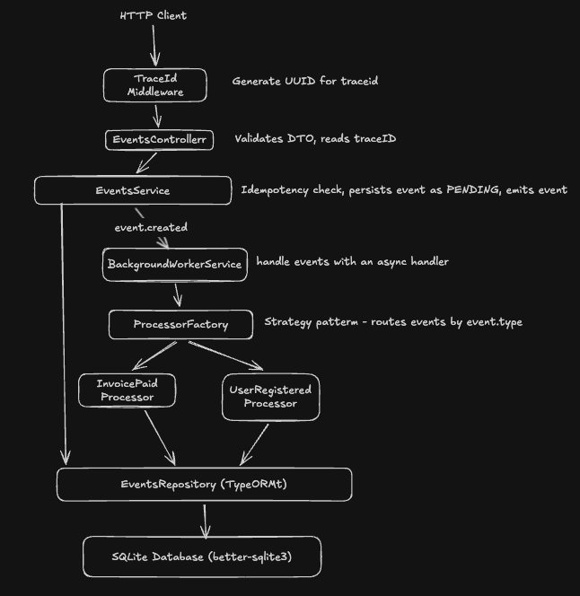

# BetClicks Event Gateway

A production-ready NestJS event processing system built as a Senior Backend Engineer assessment. The system ingests events via a REST API, processes them asynchronously using the Strategy/Factory pattern, and provides full observability through tracing, metrics, and health endpoints.

---

## Table of Contents

1. [Project Overview](#project-overview)
2. [Architecture Diagram](#architecture-diagram)
3. [Architecture Decisions](#architecture-decisions)
4. [Queue / Async Processing Documentation](#queue--async-processing-documentation)
5. [Structured Logging](#structured-logging)
6. [Centralized Error Handling](#centralized-error-handling)
7. [Sample Requests and Responses](#sample-requests-and-responses)
8. [Retry Strategy](#retry-strategy)
9. [Migrations](#migrations)
10. [Seed Endpoint](#seed-endpoint)
11. [Running the App](#running-the-app)
12. [Running Tests](#running-tests)
13. [Known Trade-offs and Future Improvements](#known-trade-offs-and-future-improvements)

---

## Project Overview

The BetClicks Event Gateway is an event ingestion and processing service that:

- Accepts events via `POST /events` with full validation and idempotency
- Persists events to a SQLite database via TypeORM
- Processes events asynchronously in the background using a Strategy/Factory pattern
- Supports exponential backoff retry with up to 3 retries per event
- Provides filtering and paginated querying of events via `GET /events`
- Exposes Prometheus-style in-memory metrics at `GET /metrics`
- Reports database health at `GET /health`
- Correlates all HTTP and worker logs through a `traceId` flowing from request to database to background worker

The project demonstrates Domain Driven Design with clear separation of responsibilities across Controller, Service, Repository, and Processor layers.

---

## Architecture Diagram



Response pipeline (all paths):
```
Controller return value
    -> LoggingInterceptor   (logs "METHOD /path STATUS — Xms" on completion)
    -> ResponseInterceptor  (adds traceId + durationMs + path to body)
    -> HTTP Response

Thrown exception
    -> GlobalExceptionFilter  (structured JSON with traceId + durationMs)
    -> HTTP Error Response
```

---

## Architecture Decisions

### TypeORM over Prisma

TypeORM was chosen because:
- It integrates natively with the NestJS module system via `@nestjs/typeorm`
- It has mature SQLite support through `better-sqlite3`
- The `@InjectRepository()` decorator fits naturally with NestJS dependency injection
- Migration tooling (`typeorm migration:generate`) is built in and works from a standalone `dataSource.ts` without requiring a separate CLI installation

Prisma would be a valid alternative for its excellent type safety and developer experience, but introduces a separate migration workflow and schema definition language that adds overhead for a self-contained service.

### EventEmitter2 over a dedicated queue (BullMQ/Redis)

`@nestjs/event-emitter` with EventEmitter2 was chosen because:
- It runs in-process with zero infrastructure dependencies — no Redis, no separate broker
- Latency is effectively zero: the event is dispatched synchronously and the handler runs as a detached async task
- The `@OnEvent` decorator integrates cleanly with NestJS's module system
- Acceptable for single-instance deployments with moderate throughput

For production at scale, see the recommendation in [Queue / Async Processing Documentation](#queue--async-processing-documentation).

### traceId embedded in the entity

The `traceId` is generated in `TraceIdMiddleware`, attached to `req.traceId`, extracted in the controller via a custom `@TraceId()` parameter decorator, stored as a column on the `event` entity in the database, and read from `event.traceId` inside `BackgroundWorkerService`.

This approach was chosen over `AsyncLocalStorage` because:
- It is explicit and inspectable — the traceId can be queried directly from the database for any event
- It has zero overhead from async context propagation
- The worker always has access to the correct traceId via the entity, even after a process restart (if recovery logic were added)

### `type` field whitelisted via EventType enum; `source` is open-ended

The `type` field drives business logic — the `ProcessorFactory` uses it to route to the correct processor. A closed enum (`invoice.paid`, `user.registered`) prevents unknown types from entering the system and causing runtime errors.

The `source` field is metadata only (it identifies which client system sent the event). It is validated as a non-empty string but is not restricted to a fixed set, allowing new client integrations without code changes.

### payload stored as `text` with explicit JSON serialization

TypeORM's `simple-json` column type uses `JSON.parse`/`JSON.stringify` internally but its behavior with SQLite can be inconsistent — particularly when reading back values that were stored without a round-trip. Storing `payload` as `text` with explicit `JSON.stringify` on write and `JSON.parse` on read in the service layer is more predictable and easier to reason about.

### In-memory metrics

The `AppMetricsService` uses simple in-process counters (`received`, `processed`, `failed`). This is sufficient for a single-instance deployment and a demonstration context.

**Important caveat** (documented in `metricsService.ts`): these counters reset on every process restart and do not aggregate across multiple instances. A production-grade alternative would derive metrics from the database:

```sql
SELECT status, COUNT(*) as count FROM event GROUP BY status;
```

This query survives restarts, is always consistent with the actual data, and works across horizontally scaled instances.

### `synchronize: true` only in test environment

`synchronize: true` auto-drops and recreates tables on startup to match the entity definition. This is convenient for testing with in-memory SQLite but dangerous in production (schema changes would silently drop data). The `AppModule` uses `synchronize: true` only when `NODE_ENV === 'test'` and runs migrations in all other environments.

---

## Queue / Async Processing Documentation

### Current approach

When a new event is ingested via `POST /events`, `EventsService.ingest()` emits the `event.created` event using `EventEmitter2`:

```typescript
this.eventEmitter.emit('event.created', savedEntity);
```

`BackgroundWorkerService` listens with `@OnEvent('event.created', { async: true })`. The `async: true` option means the handler is invoked as a detached async task — the HTTP response is returned to the client before processing completes.

### Documented assumptions

1. **Same-process coupling**: The worker runs in the same Node.js process as the HTTP server. If the process crashes between event ingestion and processing completion, the event remains in `status=pending` in the database and will NOT be automatically retried on restart. A recovery sweep on startup (query all `pending` events and re-emit them) would be needed for crash safety.

2. **No concurrency control**: Each `event.created` emission creates a new independent async handler invocation. There is no back-pressure mechanism — a burst of events will launch that many concurrent handler tasks.

3. **No dead-letter queue**: After all retries are exhausted, the event is marked `status=failed` with an `errorMessage`. There is no separate dead-letter queue for manual inspection or replay.

4. **Retry delays use setTimeout**: Each retry delay (`[1000ms, 2000ms, 4000ms]`) is implemented via `Promise`-wrapped `setTimeout`. These do not block the Node.js event loop or prevent new HTTP requests from being served.

### Production recommendation

Replace `EventEmitter2` with **BullMQ** (Redis-backed):

```
POST /events -> EventsService -> BullMQ producer (adds job to Redis queue)
                                       |
                              BullMQ Worker Process
                                       |
                              ProcessorFactory -> Processor
```

BullMQ provides:
- **Persistence**: Jobs survive process restarts
- **Built-in retry**: Configurable exponential backoff at the queue level
- **Dead-letter queue**: Failed jobs move to a separate "failed" set for inspection
- **Concurrency control**: Worker concurrency can be set explicitly
- **Horizontal scaling**: Multiple worker processes can consume from the same queue
- **Rate limiting**: Prevent overwhelming downstream services

---

## Structured Logging

HTTP traffic is logged by a global `LoggingInterceptor` — one line per request, emitted when the response is sent:

```
[Nest] 12345  - 01/15/2024, 10:30:00 AM     LOG [HTTP] [traceId: a1b2c3d4-...] POST /events 201 — 12ms
[Nest] 12345  - 01/15/2024, 10:30:00 AM     LOG [HTTP] [traceId: b2c3d4e5-...] GET /events 200 — 8ms
[Nest] 12345  - 01/15/2024, 10:30:00 AM   ERROR [HTTP] [traceId: c3d4e5f6-...] POST /events 400 — 3ms
```

Background worker activity is logged by each service class using the NestJS `Logger` with a per-class context string:

```typescript
private readonly logger = new Logger(BackgroundWorkerService.name);
```

Every worker log line includes the `traceId` read from the entity, correlating it back to the originating HTTP request:

```
[Nest] 12345  - 01/15/2024, 10:30:00 AM     LOG [EventsService] [traceId: a1b2c3d4-...] Ingested new event id=252456-326456-2fvw45t-4w5y3245, emitting event.created
[Nest] 12345  - 01/15/2024, 10:30:00 AM     LOG [BackgroundWorkerService] [traceId: a1b2c3d4-...] Worker picked up event id=252456-326456-2fvw45t-4w5y3245
[Nest] 12345  - 01/15/2024, 10:30:00 AM     LOG [InvoicePaidProcessor] [traceId: a1b2c3d4-...] Processing invoice.paid event id=252456-326456-2fvw45t-4w5y3245
[Nest] 12345  - 01/15/2024, 10:30:00 AM     LOG [BackgroundWorkerService] [traceId: a1b2c3d4-...] Event id=252456-326456-2fvw45t-4w5y3245 processed successfully
```

Log levels used:
- `log` — normal flow (HTTP requests, ingestion, processing success)
- `warn` — retry attempts (non-fatal, will be retried)
- `error` — HTTP errors (4xx/5xx) and permanent processing failures (all retries exhausted)

---

## Centralized Error Handling

`GlobalExceptionFilter` is registered globally in `main.ts` via `app.useGlobalFilters()`. It catches all unhandled exceptions from any route handler.

Response shape for all errors:

```json
{
  "statusCode": 400,
  "message": "source must be a string, type must be one of: invoice.paid, user.registered",
  "error": "Bad Request",
  "traceId": "a1b2c3d4-e5f6-7890-abcd-ef1234567890",
  "durationMs": 3,
  "timestamp": "2024-01-15T10:30:00.000Z"
}
```

Key behaviors:
- `ValidationPipe` errors (from `class-validator`) are caught and their `message` arrays are joined into a single string
- `HttpException` subclasses are handled with their correct status codes
- Unknown errors (e.g., database errors) fall back to `500 Internal Server Error`
- Processor errors thrown inside `BackgroundWorkerService` are caught by the worker's `try/catch` block, stored as `errorMessage` on the entity, and do NOT propagate to the HTTP layer

---

## Sample Requests and Responses

### POST /events — Create a new event (201)

```bash
curl -X POST http://localhost:3000/events \
  -H "Content-Type: application/json" \
  -d '{
    "eventId": "evt-001",
    "source": "betclicks-web",
    "type": "invoice.paid",
    "timestamp": "2024-01-15T10:30:00.000Z",
    "payload": {
      "invoiceId": "INV-123",
      "amount": 150.00,
      "currency": "USD"
    }
  }'
```

Response (201 Created):
```json
{
  "statusCode": 201,
  "isNew": true,
  "event": {
    "id": "252456-326456-2fvw45t-4w5y3245",
    "eventId": "evt-001",
    "source": "betclicks-web",
    "type": "invoice.paid",
    "status": "pending",
    "payload": { "invoiceId": "INV-123", "amount": 150.00, "currency": "USD" },
    "traceId": "a1b2c3d4-e5f6-7890-abcd-ef1234567890",
    "errorMessage": null,
    "processedAt": null,
    "createdAt": "2024-01-15T10:30:00.123Z",
    "timestamp": "2024-01-15T10:30:00.000Z",
    "retryCount": 0
  },
  "traceId": "a1b2c3d4-e5f6-7890-abcd-ef1234567890",
  "durationMs": 12
}
```

### POST /events — Duplicate event (200, idempotency)

```bash
curl -X POST http://localhost:3000/events \
  -H "Content-Type: application/json" \
  -d '{
    "eventId": "evt-001",
    "source": "betclicks-web",
    "type": "invoice.paid",
    "timestamp": "2024-01-15T10:30:00.000Z",
    "payload": { "invoiceId": "INV-123", "amount": 150.00 }
  }'
```

Response (200 OK):
```json
{
  "statusCode": 200,
  "isNew": false,
  "event": {
    "id": "252456-326456-2fvw45t-4w5y3245",
    "eventId": "evt-001",
    "status": "processed",
    ...
  },
  "traceId": "b2c3d4e5-f6a7-8901-bcde-f12345678901",
  "durationMs": 5
}
```

### POST /events — Validation error (400)

```bash
curl -X POST http://localhost:3000/events \
  -H "Content-Type: application/json" \
  -d '{ "eventId": "evt-bad" }'
```

Response (400 Bad Request):
```json
{
  "statusCode": 400,
  "message": "source should not be empty, source must be a string, type must be one of: invoice.paid, user.registered, timestamp must be a valid ISO 8601 date string, payload must be an object",
  "error": "Bad Request",
  "traceId": "c3d4e5f6-a7b8-9012-cdef-123456789012",
  "durationMs": 2,
  "timestamp": "2024-01-15T10:30:01.000Z"
}
```

### GET /events — All events (default pagination)

```bash
curl "http://localhost:3000/events"
```

Response (200 OK):
```json
{
  "data": [
    {
      "id": "252456-326456-2fvw45t-4w5y3245",
      "eventId": "evt-001",
      "source": "betclicks-web",
      "type": "invoice.paid",
      "status": "processed",
      "payload": { "invoiceId": "INV-123", "amount": 150.00 },
      "traceId": "a1b2c3d4-...",
      "createdAt": "2024-01-15T10:30:00.123Z",
      "processedAt": "2024-01-15T10:30:01.456Z",
      "retryCount": 0
    }
  ],
  "total": 1,
  "limit": 10,
  "offset": 0,
  "traceId": "d4e5f6a7-b8c9-0123-defa-234567890123",
  "durationMs": 8
}
```

### GET /events — With filters and pagination

```bash
curl "http://localhost:3000/events?filter[type]=invoice.paid&filter[source]=betclicks-web&filter[status]=processed&sort[createdAt]=desc&limit=5&offset=0"
```

### GET /metrics

```bash
curl http://localhost:3000/metrics
```

Response (200 OK):
```json
{
  "metrics": {
    "received": 10,
    "processed": 8,
    "failed": 2
  },
  "traceId": "e5f6a7b8-c9d0-1234-efab-345678901234",
  "durationMs": 1
}
```

### GET /health

```bash
curl http://localhost:3000/health
```

Response (200 OK):
```json
{
  "status": "ok",
  "info": {
    "database": { "status": "up" }
  },
  "error": {},
  "details": {
    "database": { "status": "up" }
  }
}
```

### POST /events/seed

```bash
curl -X POST http://localhost:3000/events/seed
```

Response (200 OK — first call, database was empty):
```json
{
  "data": [
    { "id": "<uuid>", "eventId": "seed-evt-001", "source": "betclicks-web", "type": "invoice.paid", ... },
    { "id": "<uuid>", "eventId": "seed-evt-002", "source": "betclicks-mobile", "type": "user.registered", ... },
    ...
  ],
  "traceId": "f6a7b8c9-d0e1-2345-fabc-456789012345",
  "durationMs": 45
}
```

Response (200 OK — subsequent calls):
```json
{
  "message": "Database already seeded",
  "count": 5,
  "traceId": "...",
  "durationMs": 3
}
```

---

## Retry Strategy

Events that fail during processing are retried with exponential backoff:

| Attempt | Delay before retry |
|---------|-------------------|
| 1st failure | 1,000 ms |
| 2nd failure | 2,000 ms |
| 3rd failure | 4,000 ms |
| 4th failure | No more retries — mark as FAILED |

The current retry count is persisted to the `retryCount` column in the database after each failed attempt. This allows operators to query events that required retries:

```bash
curl "http://localhost:3000/events?filter[status]=failed"
```

The `errorMessage` column stores the error message from the final failure. The `processedAt` column is set only on successful processing.

Status transitions:

```
PENDING -> PROCESSING -> PROCESSED
                      -> FAILED (after all retries exhausted)
```

The retry logic lives in `BackgroundWorkerService.processWithRetry()`. The exported constants `MAX_RETRIES` and `RETRY_DELAYS_MS` allow unit tests to reference the same values without hardcoding them.

---

## Migrations

TypeORM migrations are used in development and production environments instead of `synchronize: true` (which is only used for in-memory SQLite in the test environment).

### dataSource.ts

The project root contains a `dataSource.ts` file that exports a standalone `DataSource` instance for use by the TypeORM CLI:

```typescript
const AppDataSource = new DataSource({
  type: 'better-sqlite3',
  database: process.env.DATABASE_PATH || './data/events.db',
  entities: [Event],
  migrations: ['src/migrations/*.ts'],
  synchronize: false,
});

export default AppDataSource;
```

> The file uses a single `export default` — the TypeORM CLI requires exactly one DataSource export and will error if there are both a named and a default export.

It loads `.env` via `dotenv` so CLI commands read the correct `DATABASE_PATH`.

### Available commands

```bash
# Generate a new migration from entity changes
npm run migration:generate

# Apply pending migrations
npm run migration:run

# Revert the last applied migration
npm run migration:revert
```

> The migration scripts invoke the TypeORM CLI via `ts-node` so the CLI can compile `dataSource.ts` and the entity files directly without a prior build step.

### Initial migration

The initial migration is at `src/migrations/1711407600000-InitialSchema.ts`. It creates the `event` table with all required columns. Run it before starting the application for the first time:

```bash
npm run migration:run
npm run start:dev
```

---

## Seed Endpoint

`POST /events/seed` inserts 5 sample events covering both event types (`invoice.paid` and `user.registered`) from three different source systems.

Behavior:
- If `NODE_ENV === 'production'`, returns `{ message: 'Seeding is disabled in production' }` with no side effects
- If the `event` table already has rows, returns `{ message: 'Database already seeded', count: N }` with no side effects
- If the table is empty, inserts all 5 seed events and returns `{ data: [...] }` with the created entities

The seed uses the same `EventsService.ingest()` path as real events, meaning each seed event is also processed asynchronously by `BackgroundWorkerService`.

---

## Running the App

### Prerequisites

- Node.js >= 18
- npm >= 9

### Setup

```bash
# Clone and enter the project
cd betclicks-event-gateway

# Install dependencies
npm install

# Copy environment configuration
cp .env.example .env

# Create the data directory and run migrations
mkdir -p data
npm run migration:run

# Start in development mode (watch + reload)
npm run start:dev
```

The application starts on `http://localhost:3000` by default.

Available endpoints:
- `POST /events` — Ingest an event
- `GET /events` — Query events with filtering and pagination
- `POST /events/seed` — Seed dummy data (dev only)
- `GET /metrics` — In-memory processing metrics
- `GET /health` — Database health check
- `GET /api` — Swagger UI documentation

### Environment variables

| Variable | Default | Description |
|----------|---------|-------------|
| `PORT` | `3000` | HTTP server port |
| `NODE_ENV` | `development` | Environment (`development`, `production`, `test`) |
| `DATABASE_PATH` | `./data/events.db` | Path to the SQLite database file |

---

## Running Tests

### Unit tests

```bash
npm run test
```

Runs all `*.spec.ts` files under `src/`. Test suites:

| Suite | File | What it tests |
|-------|------|---------------|
| ProcessorFactory | `src/events/processors/processorFactory.spec.ts` | Correct processor routing, error on unknown type |
| InvoicePaidProcessor | `src/events/processors/invoicePaidProcessor.spec.ts` | Resolves without error, logs traceId |
| UserRegisteredProcessor | `src/events/processors/userRegisteredProcessor.spec.ts` | Resolves without error, logs traceId |
| BackgroundWorkerService | `src/events/workers/backgroundWorkerService.spec.ts` | Failure state marks event as failed, success marks as processed |

### E2E tests

```bash
npm run test:e2e
```

Runs `test/events.e2e-spec.ts` with a real NestJS app and in-memory SQLite:

| Test | Description |
|------|-------------|
| Test 1 | `POST /events` with valid body returns 201 and saves event with `status=pending` |
| Test 2 | Sending the same `eventId` twice returns 201 then 200 (idempotency) |
| Test 3 | Missing required fields returns 400 with structured error body |

### Coverage report

```bash
npm run test:cov
```

Generates an HTML coverage report in `./coverage/`.

---

## Known Trade-offs and Future Improvements

### Trade-offs accepted in this implementation

1. **In-process queue (EventEmitter2)**: Events not yet processed when the process restarts remain `pending` in the database permanently. A startup sweep to re-emit pending events would close this gap, but is not implemented. Replace with BullMQ for true durability.

2. **In-memory metrics**: Counters reset on restart. For multi-instance deployments, derive counts from the database directly (`SELECT status, COUNT(*) FROM event GROUP BY status`).

3. **Single SQLite file**: SQLite does not support true concurrent writes. For higher write throughput, migrate to PostgreSQL with `@nestjs/typeorm` — the repository layer requires no changes.

4. **No authentication or authorization**: All endpoints are publicly accessible. A production system would require API key validation or JWT middleware.

5. **No rate limiting**: The ingestion endpoint has no throttle. Add `@nestjs/throttler` to prevent abuse.

6. **No event ordering guarantees**: `BackgroundWorkerService` processes each event as it arrives. If two events arrive in rapid succession for the same user or invoice, their processing order depends on async scheduling, not arrival order.

### Future improvements

- Replace `EventEmitter2` with **BullMQ** + Redis for persistent, distributed job processing with a proper dead-letter queue
- Add a startup recovery sweep that re-emits all `pending` events from the database
- Replace in-memory metrics with **Prometheus** (`prom-client`) and expose at `/metrics` in the standard Prometheus scrape format
- Add **OpenTelemetry** distributed tracing for spans across HTTP, queue, and database layers
- Implement a configurable **dead-letter endpoint** (`GET /events?filter[status]=failed`) with a manual retry action (`POST /events/:id/retry`)
- Add database-level indexes on `status`, `type`, and `createdAt` columns for query performance at scale
- Integrate **PostgreSQL** for production deployments (the TypeORM + Repository pattern means only the `DataSource` configuration needs to change)
